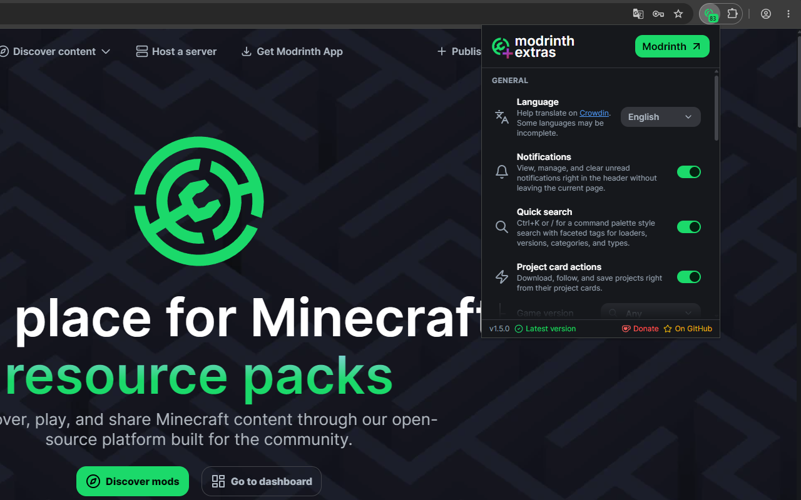
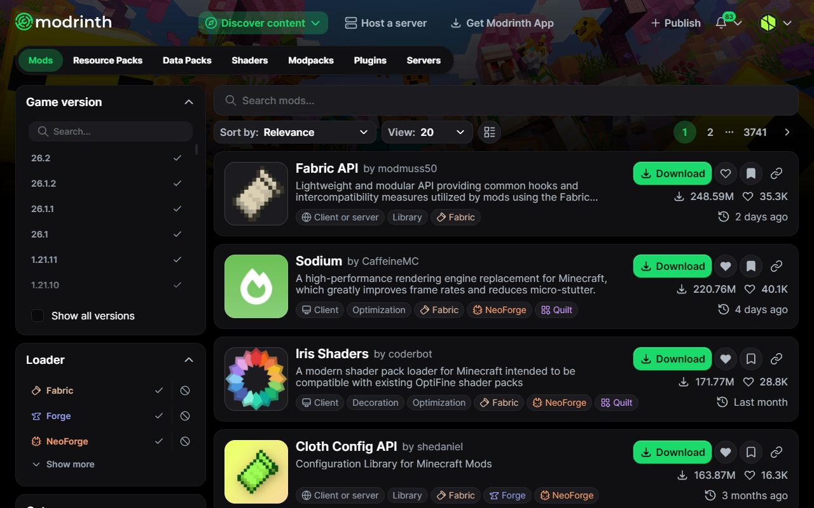
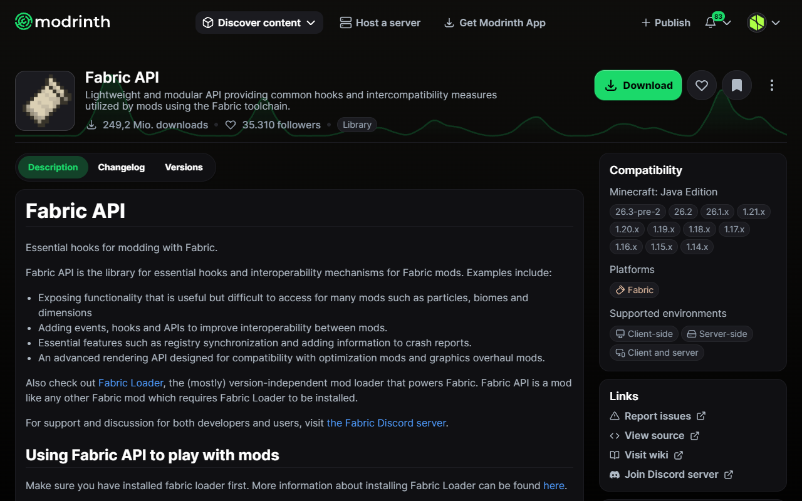
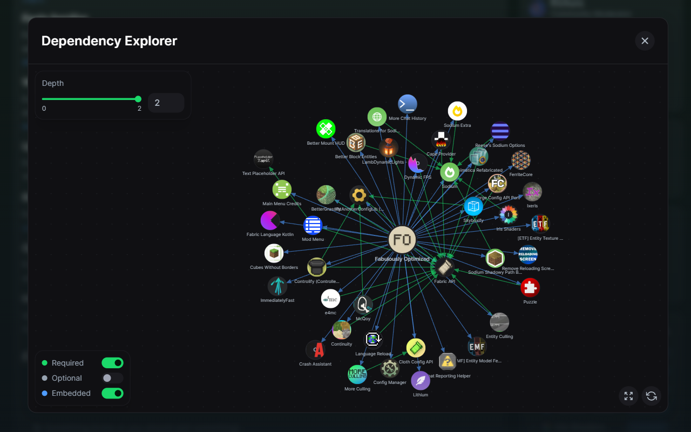
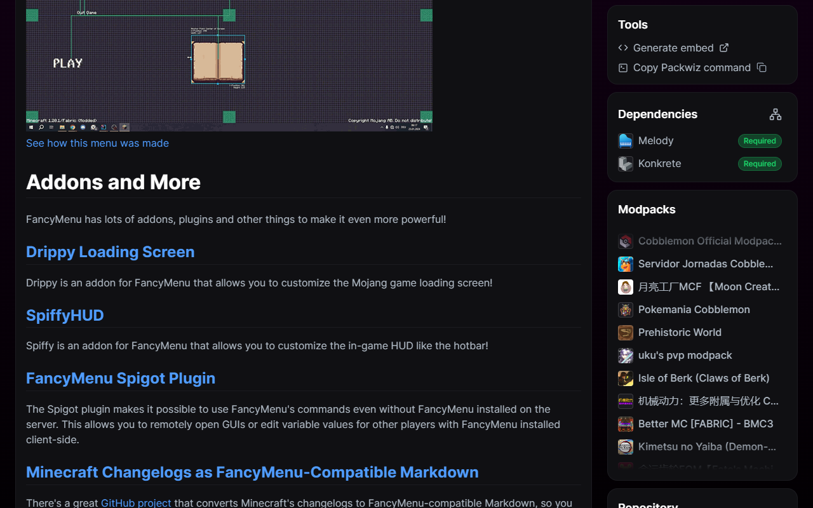
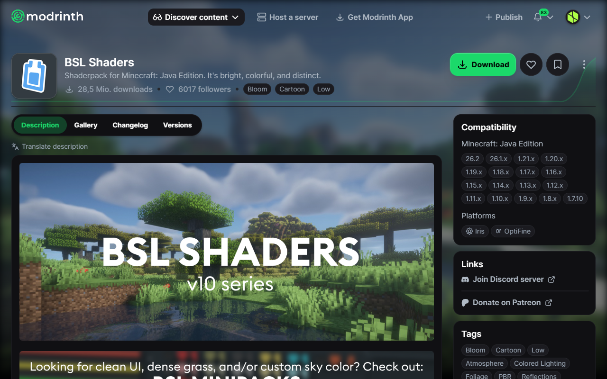

# 

A browser extension that enhances Modrinth on the website and beyond.


[](https://crowdin.com/project/modrinth-extras)


[](https://ko-fi.com/creeperkatze)

> [!NOTE]
> The extension is not associated with or endorsed by Modrinth.

## 🚀 Installation

Install from your browser's extension store:

- **[Chrome Web Store](https://chromewebstore.google.com/detail/modrinth-extras/ajmkilipadfpaefpcjfgnkejalmhdlcj)** 
- **[Firefox Add-Ons](https://addons.mozilla.org/firefox/addon/modrinth-extras/)** 
- **[Edge Add-Ons](https://microsoftedge.microsoft.com/addons/detail/modrinth-extras/jkfgnimibfpoohbmaibjdjdmfnjmbjcj)** 

Prefer to build from source? See [Building from source](#-building-from-source) below.

## ✨ Features

All features can be individually toggled from the extension popup.



### General

<table>
<tr>
<td width="50%"><b>Language</b><br>Help translate on <a href="https://crowdin.com/project/modrinth-extras">Crowdin</a>. Some languages may be incomplete.</td>
<td width="50%"><b>Notifications</b><br>View, manage, and clear unread notifications right in the header without leaving the current page.</td>
</tr>
<tr>
<td width="50%"><b>Quick search</b><br>Ctrl+K or / for a command palette style search with faceted tags for loaders, versions, categories, and types.</td>
<td width="50%"><b>Project card actions</b><br>Download, follow, and save projects right from their project cards.</td>
</tr>
<tr>
<td width="50%"><b>Accent color</b><br>Replace the Modrinth green with a custom accent color.</td>
<td width="50%"></td>
</tr>
</table>

### Content pages

<table>
<tr>
<td width="50%"><b>Activity sparkline</b><br>Release activity chart on project pages.</td>
<td width="50%"><b>Tools sidebar</b><br>Generate embeds and copy mod manager install commands.</td>
</tr>
<tr>
<td width="50%"><b>Dependency sidebar</b><br>Collapsible dependency tree on project pages.</td>
<td width="50%"><b>Dependency explorer</b><br>Interactive graph for exploring the full dependency tree.</td>
</tr>
<tr>
<td width="50%"><b>Repository sidebar</b><br>Stars, issues, pull requests, and forks for linked GitHub, GitLab, Codeberg, and Bitbucket repositories.</td>
<td width="50%"><b>Discord sidebar</b><br>Server name, description, member count, and online count for linked Discord servers.</td>
</tr>
<tr>
<td width="50%"><b>Modpacks sidebar</b><br>Show all the modpacks the mod is featured in.</td>
<td width="50%"><b>Other platforms sidebar</b><br>Find the same project or author on CurseForge, Hangar, and SpigotMC.</td>
</tr>
<tr>
<td width="50%"><b>Gallery background</b><br>Display the featured gallery image as a background banner on project pages.</td>
<td width="50%"><b>Monetization badge</b><br>Show the monetization status of a project in the sidebar.</td>
</tr>
<tr>
<td width="50%"><b>Translate description</b><br>On-device translation of a project's description into your language, when it differs.</td>
<td width="50%"></td>
</tr>
</table>

### Flags

<table>
<tr>
<td width="50%"><b>Search background</b><br>Show a banner background on the discover pages.</td>
<td width="50%"><b>Project type navigation</b><br>Move mods, plugins, resource packs, and other project types into the main navigation bar.</td>
</tr>
</table>

### Extension

<table>
<tr>
<td width="50%"><b>Notification badge</b><br>Up-to-date unread notification count as a badge on the extension icon.</td>
<td width="50%"><b>Browser notifications</b><br>Browser notifications for your Modrinth notifications.</td>
</tr>
<tr>
<td width="50%"><b>CurseForge redirect</b><br>Redirect CurseForge project pages to Modrinth when available.</td>
<td width="50%"><b>Telemetry</b><br>Help improve the extension by anonymously sharing statistics like the extension version and which features are enabled. No Modrinth data, activity, or personal information is ever collected.</td>
</tr>
</table>

## 📸 Screenshots

<table>
<tr>
<td width="50%"><br><i>Notifications</i></td>
<td width="50%"><br><i>Quick search</i></td>
</tr>
<tr>
<td width="50%"><br><i>Project card actions</i></td>
<td width="50%"><br><i>Activity sparkline</i></td>
</tr>
<tr>
<td width="50%"><br><i>Dependency explorer</i></td>
<td width="50%"><br><i>Sidebars</i></td>
</tr>
<tr>
<td width="50%"><br><i>Gallery background</i></td>
<td width="50%"></td>
</tr>
</table>

## 🔒 Building from source

If you don't want to trust the store release, you can build the extension yourself directly from the source code and verify it matches what's in the release.

**Prerequisites:** [Node.js](https://nodejs.org) and [pnpm](https://pnpm.io)

```bash
# Clone and check out the version you want to verify (e.g. v1.3.3)
git clone --recurse-submodules https://github.com/creeperkatze/modrinth-extras.git
cd modrinth-extras
git checkout v1.3.3

pnpm install

# Chrome / Edge
pnpm zip

# Firefox
pnpm zip:firefox
```

The resulting zips in `.output/` are identical to those attached to the [GitHub release](https://github.com/creeperkatze/modrinth-extras/releases) for that tag.

To install the extension manually:

- **Chrome / Edge:** go to `chrome://extensions/`, enable **Developer mode**, then drag and drop the zip onto the page.
- **Firefox:** go to `about:debugging#/runtime/this-firefox`, click **Load Temporary Add-on**, and select the zip. Note that Firefox removes the extension on browser restart since it is loaded as a temporary add-on.


## 👨‍💻 Development

### Setup

> [!IMPORTANT]
> The `--recurse-submodules` flag is required as the project imports packages from the [modrinth](https://github.com/modrinth/code) monorepo as a git submodule.

```bash
git clone --recurse-submodules https://github.com/creeperkatze/modrinth-extras.git
cd modrinth-extras

pnpm install
```

### Chrome

```bash
pnpm build
```

Then go to `chrome://extensions/`, enable **Developer mode**, click **Load unpacked**, and select the `.output/chrome-mv3` folder. After rebuilding, just click on the reload icon.

### Firefox

```bash
pnpm zip:firefox
```

Then go to `about:debugging#/runtime/this-firefox`, click **Load Temporary Add-on**, and select the zip from the `.output/` folder. After rebuilding, repeat this process.

> [!NOTE]
> `pnpm dev` can also be used during development to automatically create a temporary browser with the extension pre-loaded. Keep in mind that this browser profile is isolated, requiring you to log in each time. This method also causes issues with Modrinth's dependencies.

## 🌐 Translating

Translations are managed on [Crowdin](https://crowdin.com/project/modrinth-extras). You can contribute without any technical knowledge, just pick your language and start translating.

New translations are automatically pulled every Monday.

### Translators ❤️

| Language | Translators |
|----------|------------|
| Italian | [EmanuelPlaysDev](https://github.com/EmanuelPlays) |
| French | [maDU59_](https://github.com/maDU59), [Sertra](https://crowdin.com/profile/sertrafurr) |
| Chinese Simplified | [xinyihl](https://crowdin.com/profile/xinyihl), [AlexYang](https://crowdin.com/profile/A012pyshjs210) |
| Korean | [젠고](https://crowdin.com/profile/minejango2) |
| Vietnamese | [Lê](https://crowdin.com/profile/suri-cutie) |
| Japanese | [Finity 2010](https://crowdin.com/profile/finity2010) |
| Russian | [vanapro1](https://crowdin.com/profile/vanapro1), [IceBan](https://crowdin.com/profile/iceban) |
| Ukrainian | [Tenwoc](https://crowdin.com/profile/tenwoc), [CreativeTragern](https://crowdin.com/profile/creativetragern) |
| Turkish | [penfflewithadot](https://crowdin.com/profile/penfflewithadot), [ErenTr4210](https://crowdin.com/profile/erentr4210), [Serkan Aynacı](https://crowdin.com/profile/serkanaynaci2007) |
| Spanish, Latin America | [Dante Li Tao](https://crowdin.com/profile/heroxp) |
| Arabic | [Hamad Alsayed](https://crowdin.com/profile/hamad_sayed) |
| Spanish | [eh eh](https://crowdin.com/profile/ehuh) |

## 🤝 Contributing

Contributions are always welcome!

Please ensure you run `pnpm lint:fix` before opening a pull request.

## 📜 License

AGPL-3.0
